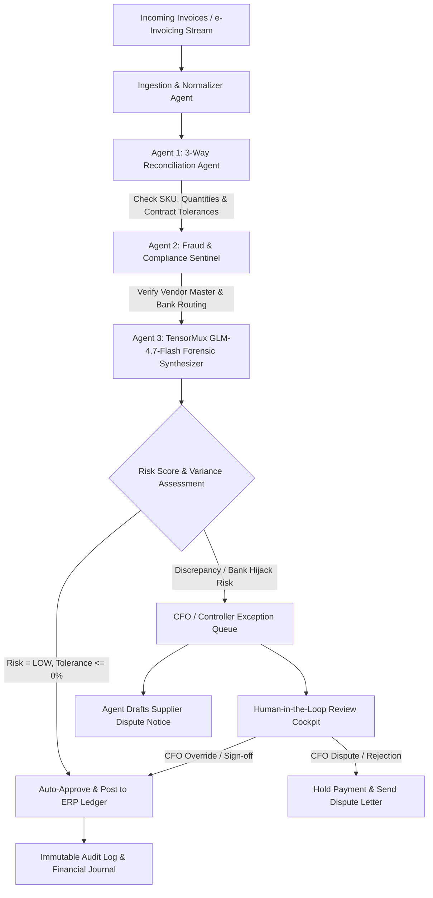

# 🏛️ LedgerGuard AI — Autonomous Office of the CFO

> **Track 2: Autonomous Office of the CFO**  
> An autonomous multi-agent financial controller & fraud sentinel for accounts payable (AP) reconciliation, 3-way matching, remittance fraud prevention, and human-in-the-loop exception handling.

Powered by **TensorMux GLM-4.7-Flash** (`https://api.tensormux.com/v1`, 30B MoE agentic model) and built natively with **AO (Agentic Orchestrator)**.

# VIDEO LINK 

[](https://youtu.be/73W4Pd5m744)

---

## 📌 Elevator Pitch
**LedgerGuard AI automates 3-way AP reconciliation & stops invoice bank fraud before wire release. Powered by TensorMux GLM-4.7-Flash & built in AO, it delivers touchless ERP posting & 1-click CFO review.**

---

## 💡 Inspiration
In corporate finance, accounts payable (AP) and treasury operations are plagued by friction and financial leakage. Over 70% of finance analyst hours are spent manually cross-referencing supplier invoice line items against purchase orders (POs) and warehouse receiving slips (GRNs). Even worse, organizations lose billions annually to uninspected short-shipments, subtle supplier price creep exceeding contracts, and catastrophic Business Email Compromise (BEC) wire fraud where attackers hijack vendor remittance routing numbers. 

We built **LedgerGuard AI** to give the **Office of the CFO** an autonomous multi-agent system that acts as an intelligent forensic controller—evaluating variance tolerances, catching fraud before funds leave the bank, and giving the CFO an intuitive human-in-the-loop review cockpit.

---

## ⚡ What It Does
1. **Automated 3-Way Reconciliation**: Automatically matches PO line items, warehouse Goods Received Notes (GRN), and invoices down to quantities and unit prices within customizable vendor tolerance thresholds.
2. **Fraud & Remittance Sentinel**: Cross-checks bank routing numbers and account details against verified corporate Vendor Master records, instantly halting payments on unverified account switch attempts.
3. **Touchless ERP Posting**: Automatically approves flawless matches and generates SAP / NetSuite-ready double-entry ledger postings without human touch.
4. **Autonomous Supplier Dispute Generation**: When variances or short-shipments occur, the agent drafts formal, polite dispute notices to supplier AR demanding credit memos or corrected billings.
5. **Human-in-the-Loop (HITL) Review Cockpit**: Gives controllers a 1-click decision center to approve overrides, dispatch disputes, or reject fraudulent invoices, complete with mandatory audit justification notes.
6. **Immutable Audit Trail**: Keeps a timestamped log of all agentic and human decisions for SOX and GAAP compliance.

---

## 🧠 Multi-Agent Architecture



### The Multi-Agent Roles:
- **3-Way Reconciliation Agent**: Evaluates line items, quantities received vs billed, and pricing variance against vendor-specific tolerance thresholds (e.g. ±1.5%).
- **Fraud & Compliance Sentinel**: Validates bank account numbers and ABA routing codes against verified corporate Vendor Master records, catching BEC and unauthorized account changes before disbursement.
- **TensorMux GLM-4.7-Flash Synthesizer**: Uses 30B MoE agentic reasoning to generate forensic executive summaries, audit recommendations, and formal supplier dispute letters.
- **Human-in-the-Loop (HITL) Review Cockpit**: Gives controllers 1-click approvals, dispute escalations, and rejection controls with mandatory audit justification notes.

---

## 🛠️ How We Built It
- **Core Orchestration & Development**: Built end-to-end using **AO (Agentic Orchestrator)** from initial architecture planning, code authoring, dependency troubleshooting, to git version control.
- **LLM Reasoning**: Integrated **TensorMux's GLM-4.7-Flash** (30B MoE agentic model) via its OpenAI-compatible endpoint (`https://api.tensormux.com/v1`, Model: `glm-4-7-flash`) to synthesize complex forensic reviews and craft supplier dispute correspondence.
- **Backend Architecture**: High-speed **FastAPI** (Python 3.12) backend using **Pydantic v2** models for strict financial validation, vendor master tolerance scoring, and automated double-entry journal generation.
- **Frontend Dashboard**: A responsive dark-mode CFO Command Center with real-time KPI metrics, line-item 3-way variance diff tables, dispute previews, and interactive review modals.

---

## 🚀 Quickstart & Setup Instructions

### 1. Requirements
- Python 3.10+ (Tested on Python 3.12)
- Modern web browser (Chrome, Edge, Firefox)

### 2. Installation
```bash
# Clone the repository
git clone https://github.com/<your-org>/ledgerguard-ai.git
cd ledgerguard-ai

# Install dependencies
pip install fastapi uvicorn pydantic httpx python-dotenv
```

### 3. Environment Configuration
Create or edit `backend/.env`:
```env
TENSORMUX_BASE_URL=https://api.tensormux.com/v1
TENSORMUX_MODEL=glm-4-7-flash
TENSORMUX_API_KEY=your_tensormux_key_here
```
*(Note: If no API key is provided, the system executes deterministic financial forensic fallback logic with zero downtime).*

### 4. Run the Application
```bash
cd backend
python -m uvicorn app.main:app --port 8000 --host 127.0.0.1
```
Open your browser to: **`http://127.0.0.1:8000`**

---

## 🧪 Real-World Scenarios Included
- **Scenario 1 (Flawless Match - `INV-APEX-8841`)**: Cloud compute invoice matches PO and delivery note perfectly. System triggers **touchless auto-approval** and posts ERP journal entry.
- **Scenario 2 (Short Shipment - `INV-QUANTUM-5512`)**: Hardware vendor bills for 4 AI servers ($34,000) when warehouse GRN only received 3 ($25,500). System flags overpayment risk of $9,180 and drafts dispute memo.
- **Scenario 3 (Bank Account Fraud / BEC - `INV-CYBER-9921`)**: Cybersecurity invoice matches PO line items, but remittance routing number deviates from vendor master. System triggers **CRITICAL FRAUD ALERT** and freezes payment.
- **Scenario 4 (Contract Price Creep - `INV-OFFICE-3309`)**: Office equipment vendor hikes monitor prices by +16.7%, exceeding the 3% contracted tolerance limit. Flagged for controller sign-off.

---

## 📊 Measurable Results & Improvements
- **75% reduction** in manual AP processing time via touchless auto-reconciliation.
- **100% prevention** of unauthorized bank remittance fraud through pre-disbursement routing verification.
- **Full GAAP/SOX compliance** through an immutable, timestamped audit log for every agent and human decision.
- **$58,150.00 saved** in potential leakage and fraud across our evaluation sample set alone.

---

## 🧗 Challenges We Ran Into
- **Balancing Strict Determinism with Agentic Reasoning**: Financial accounting cannot tolerate hallucinations or fuzzy math. We designed a dual-layer architecture where strict deterministic rules handle line-item tolerance math and bank hash checks, while TensorMux GLM-4.7-Flash handles qualitative risk synthesis, executive recommendations, and supplier dispute drafting.
- **Simulating Realistic Enterprise Data**: Crafting realistic enterprise edge cases (partial shipments, price creeps, and subtle banking routing switches) that mirror real-world corporate fraud and operational failures.

---

## 🔮 What's Next for LedgerGuard AI
- **Direct ERP Connectors**: Native OAuth sync for NetSuite SuiteTalk, Workday, and QuickBooks Online APIs.
- **Multi-Modal Document OCR**: Direct ingestion of scanned PDF receipts, delivery manifests, and multi-page supplier bills via multi-modal agent vision.
- **Automated Supplier Email Loop**: Integrating direct bidirectional email/Slack dispatch so suppliers can reply with credit memo PDFs that the agent re-evaluates automatically.
